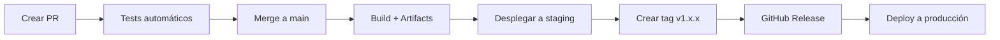

# Guía de Deployment para Servicios Cloud

Esta guía te muestra cómo desplegar la aplicación Angular en diferentes servicios cloud usando los artifacts generados por GitHub Actions.

## 📦 Obtener los Artifacts

Después de cada build exitoso en GitHub Actions:

1. Ve a la pestaña **Actions** en tu repositorio
2. Selecciona el workflow ejecutado
3. En la sección **Artifacts**, descarga:
   - `deployment-package-{sha}` para deploy directo
   - O el release completo si creaste un tag

## 🌊 Digital Ocean

### Opción 1: Digital Ocean App Platform (Recomendado)

**App Platform** gestiona automáticamente el hosting, SSL, CDN y escalamiento.

```bash
# 1. Instalar doctl CLI
# Windows: https://docs.digitalocean.com/reference/doctl/how-to/install/

# 2. Autenticarse
doctl auth init

# 3. Crear app.yaml
cat > .do/app.yaml << EOF
name: base-angular-app
services:
- name: web
  github:
    repo: tu-usuario/base-angular
    branch: main
  build_command: npm ci && npm run build
  run_command: npx http-server dist/base-angular-app/browser -p 8080
  http_port: 8080
  routes:
  - path: /
EOF

# 4. Desplegar
doctl apps create --spec .do/app.yaml
```

**Costo aproximado:** $5-12/mes

### Opción 2: Digital Ocean Droplet

Para usar un droplet con Nginx:

```bash
# 1. Crear droplet ($4-6/mes)
doctl compute droplet create base-angular \
  --image ubuntu-24-04-x64 \
  --size s-1vcpu-1gb \
  --region nyc1

# 2. Obtener IP
doctl compute droplet list

# 3. Copiar artifact al droplet
scp angular-app.zip root@YOUR_DROPLET_IP:/tmp/

# 4. SSH y configurar
ssh root@YOUR_DROPLET_IP

# Instalar Nginx
apt update && apt install -y nginx unzip

# Extraer app
mkdir -p /var/www/base-angular-app
cd /var/www/base-angular-app
unzip /tmp/angular-app.zip

# Configurar Nginx (usa el nginx.conf del artifact)
nano /etc/nginx/sites-available/base-angular-app
ln -s /etc/nginx/sites-available/base-angular-app /etc/nginx/sites-enabled/
nginx -t && systemctl reload nginx

# 5. Opcional: Configurar SSL con Let's Encrypt
apt install -y certbot python3-certbot-nginx
certbot --nginx -d tudominio.com
```

## ☁️ AWS S3 + CloudFront

Perfecto para aplicaciones Angular (SPA hosting estático).

```bash
# 1. Instalar AWS CLI
# Windows: https://aws.amazon.com/cli/

# 2. Configurar credenciales
aws configure

# 3. Crear bucket S3
aws s3 mb s3://base-angular-app

# 4. Habilitar hosting estático
aws s3 website s3://base-angular-app \
  --index-document index.html \
  --error-document index.html

# 5. Desplegar
unzip angular-app.zip -d dist
aws s3 sync dist/base-angular-app/browser s3://base-angular-app --delete

# 6. Crear distribución CloudFront (CDN)
aws cloudfront create-distribution \
  --origin-domain-name base-angular-app.s3.amazonaws.com \
  --default-root-object index.html

# 7. Invalidar caché después de cada deploy
aws cloudfront create-invalidation \
  --distribution-id YOUR_DISTRIBUTION_ID \
  --paths "/*"
```

**Costo aproximado:** $1-5/mes (tráfico incluido en free tier primer año)

## 🔷 Azure Static Web Apps

```bash
# 1. Instalar Azure CLI
# Windows: https://aka.ms/installazurecliwindows

# 2. Login
az login

# 3. Crear Static Web App
az staticwebapp create \
  --name base-angular-app \
  --resource-group myResourceGroup \
  --location "East US 2"

# 4. Desplegar
unzip angular-app.zip -d dist
az staticwebapp deploy \
  --name base-angular-app \
  --source-path dist/base-angular-app/browser

# O configurar deployment directo desde GitHub
az staticwebapp create \
  --name base-angular-app \
  --resource-group myResourceGroup \
  --source https://github.com/tu-usuario/base-angular \
  --branch main \
  --app-location "/" \
  --output-location "dist/base-angular-app/browser"
```

**Costo:** Free tier generoso (100GB bandwidth/mes)

## ▲ Vercel

La opción más simple para Angular:

```bash
# 1. Instalar Vercel CLI
npm install -g vercel

# 2. Login
vercel login

# 3. Desplegar (desde el directorio del proyecto)
vercel --prod

# O conectar directamente con GitHub (auto-deploy en cada push)
# Ve a https://vercel.com/new e importa tu repositorio
```

**Configuración automática:** Vercel detecta Angular y configura todo automáticamente.

**Costo:** Free tier muy generoso

## 🌐 Netlify

```bash
# 1. Instalar Netlify CLI
npm install -g netlify-cli

# 2. Login
netlify login

# 3. Desplegar
unzip angular-app.zip
netlify deploy --prod --dir=dist/base-angular-app/browser

# O configurar auto-deploy desde GitHub
# Ve a https://app.netlify.com/start e importa tu repositorio
```

**Costo:** Free tier generoso (100GB bandwidth/mes)

## 🚀 GitHub Pages (Gratis)

Para proyectos públicos:

```bash
# 1. Instalar angular-cli-ghpages
npm install -g angular-cli-ghpages

# 2. Build con base-href correcto
ng build --base-href "https://tu-usuario.github.io/base-angular/"

# 3. Desplegar
npx angular-cli-ghpages --dir=dist/base-angular-app/browser
```

O configurar GitHub Actions workflow:

```yaml
# .github/workflows/gh-pages.yml
name: Deploy to GitHub Pages

on:
  push:
    branches: [ main ]

jobs:
  deploy:
    runs-on: ubuntu-latest
    steps:
      - uses: actions/checkout@v4
      - uses: actions/setup-node@v4
        with:
          node-version: '20.x'
      - run: npm ci
      - run: npm run build
      - uses: peaceiris/actions-gh-pages@v3
        with:
          github_token: ${{ secrets.GITHUB_TOKEN }}
          publish_dir: ./dist/base-angular-app/browser
```

## 📊 Comparación de Servicios

| Servicio | Costo/mes | SSL Gratis | CDN | Facilidad | Mejor para |
|----------|-----------|------------|-----|-----------|------------|
| **Vercel** | Free-$20 | ✅ | ✅ | ⭐⭐⭐⭐⭐ | Deploy rápido |
| **Netlify** | Free-$19 | ✅ | ✅ | ⭐⭐⭐⭐⭐ | JAMstack apps |
| **GitHub Pages** | Free | ✅ | ✅ | ⭐⭐⭐⭐ | Proyectos públicos |
| **AWS S3+CF** | $1-5 | ✅ | ✅ | ⭐⭐⭐ | Control total |
| **Azure SWA** | Free-$9 | ✅ | ✅ | ⭐⭐⭐⭐ | Ecosistema Azure |
| **DO App Platform** | $5-12 | ✅ | ✅ | ⭐⭐⭐⭐ | Simplicidad |
| **DO Droplet** | $4-6 | Con certbot | ❌ | ⭐⭐ | Máximo control |

## 🔄 Workflow Recomendado



## 💡 Tips

1. **Staging + Producción:** Usa branches diferentes (develop → staging, main → prod)
2. **Environment Variables:** Usa Angular environments para diferentes configs
3. **Monitoring:** Agrega Google Analytics o Sentry
4. **Performance:** Habilita compresión gzip/brotli en tu servidor
5. **Cache:** Configura headers de cache para assets estáticos

## 🆘 Troubleshooting

### Error: "Cannot GET /ruta"
- Configura routing del servidor para SPA (todas las rutas → index.html)
- Vercel/Netlify: Lo hacen automático
- Nginx: Usa el `nginx.conf` incluido en los artifacts
- S3: Configura error document = index.html

### Error: "Failed to load resource"
- Verifica el `base-href` en tu build
- Revisa CORS si usas APIs externas

### Assets no cargan
- Revisa rutas relativas vs absolutas
- Verifica que el build incluyó todos los assets
